# Task GLM WebUI Tutorial

This tutorial walks through a complete fnirs-flow WebUI analysis path for a task-based GLM workflow. It uses screenshots captured from the public WebUI test run and is intended for README links, onboarding, teaching, and reviewer-facing demonstrations.

The tutorial path is:

1. Create a project.
2. Load and save a Task GLM Flow.
3. Validate and compile the Flow.
4. Bind data and inspect participant metadata.
5. Run a dry run.
6. Execute the analysis.
7. Review artifacts, QC, channel, ROI, and group results.
8. Export a reproducibility package.
9. Check system diagnostics.

## 1. Create a Project

Open the WebUI and start from the Projects page.

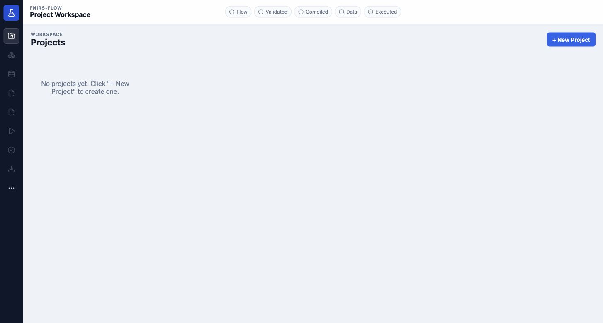

Click **New Project** and enter a project name. A clear project name is helpful because the same project will store the Flow, validation state, data binding, run records, and export history.

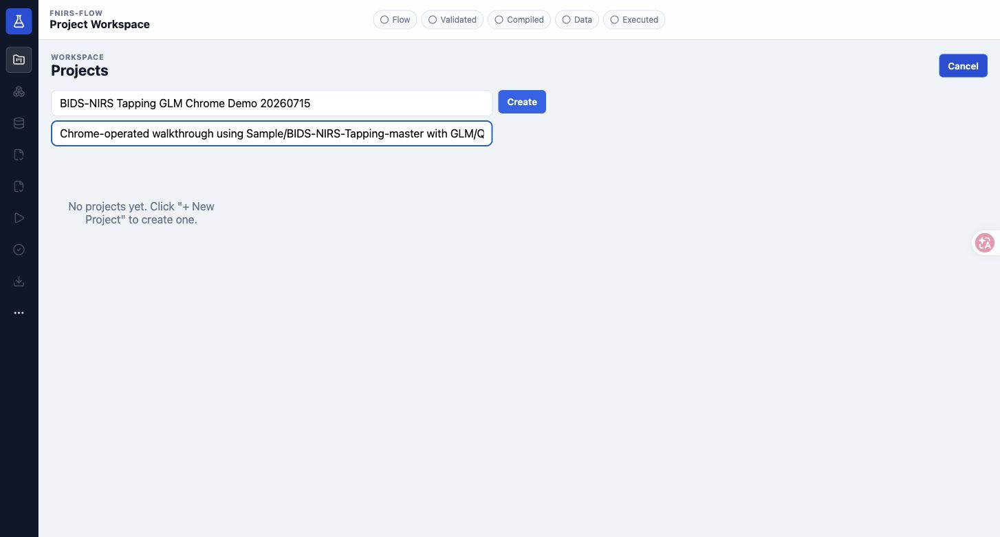

After creation, the project opens in the Flow workspace. A new project may start with an empty canvas and a MethodAtom library on the left.

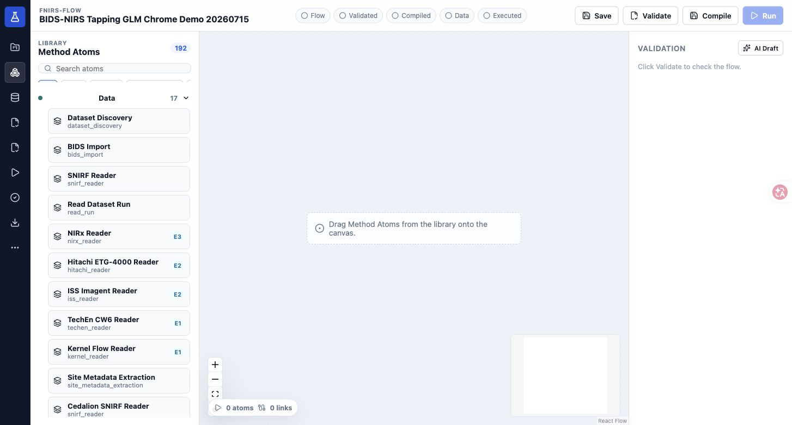

## 2. Load and Save the Task GLM Flow

Load or apply a Task GLM Flow. The Flow canvas should show the analysis chain from data inputs through preprocessing, design matrix construction, GLM, contrast estimation, QC, and outputs.

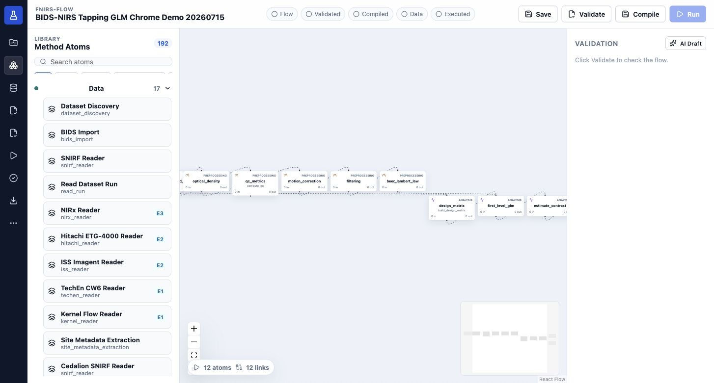

Save the Flow before moving to validation. Saving records the editable project state, not just a static picture of the canvas.

## 3. Validate and Compile

Open the validation dashboard. Validation checks the graph, ports, adapter compatibility, parameters, readiness, and fatal risks before execution is allowed.

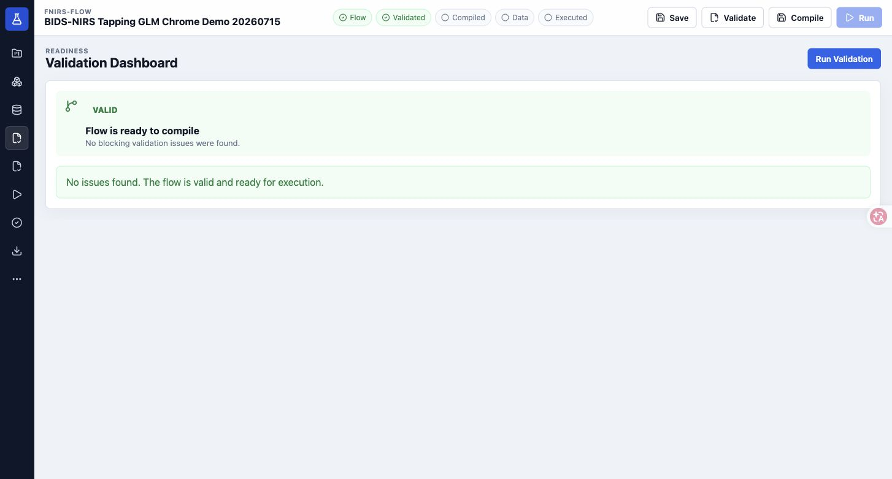

After validation, compile the Flow. Compilation turns the visual Flow into an executable plan, execution DAG, and manifest set.

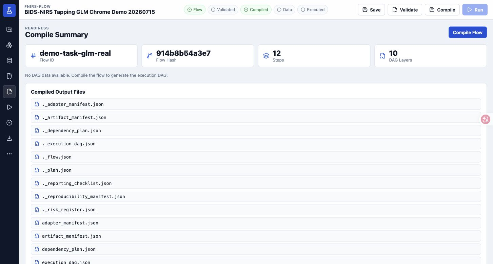

Use the compile summary to confirm the selected plan, DAG, hash, atom count, and output files. Dry run and execution should be based on the compiled plan rather than the raw canvas alone.

## 4. Bind Data and Participant Metadata

Open the Data Workspace. Select the dataset that will be used for execution.

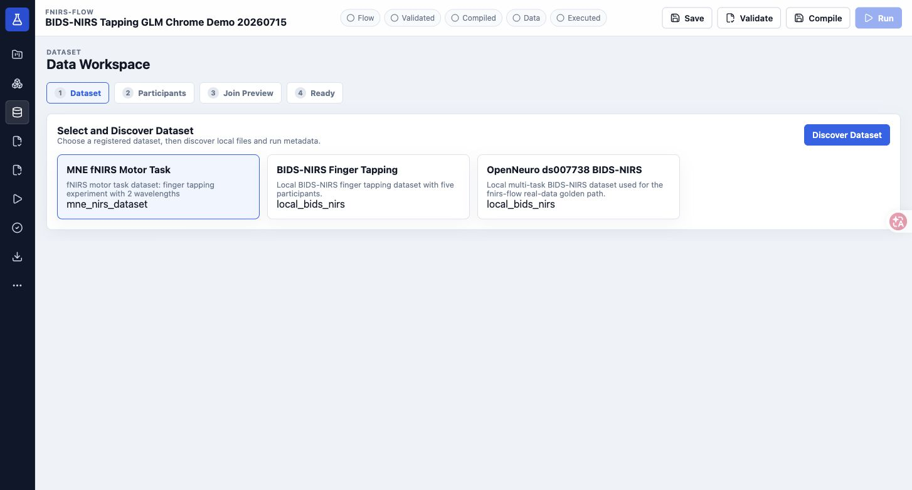

Run dataset discovery. A successful discovery result confirms that fnirs-flow can locate and describe the data source.

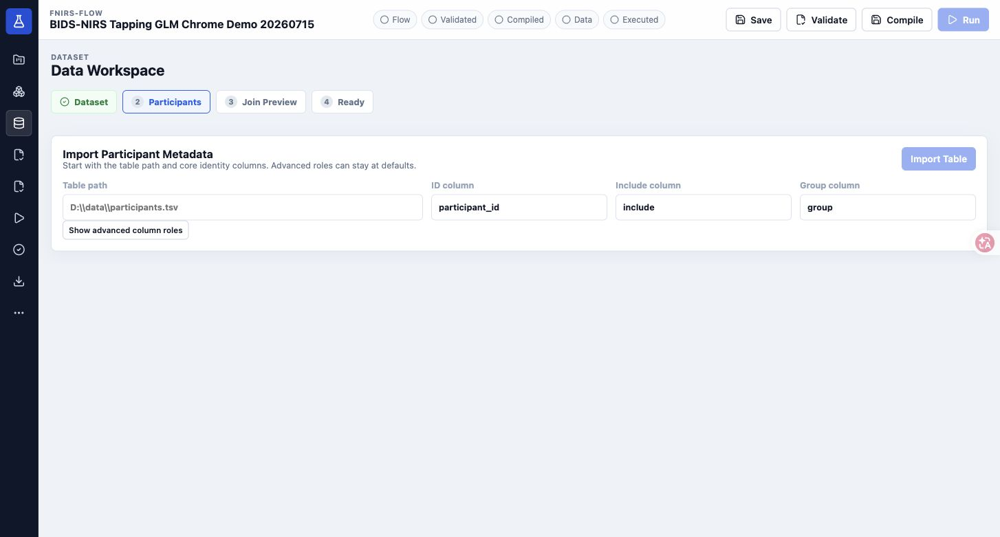

Import or configure the participant table. The Join Preview helps confirm whether participant metadata matches the discovered data.

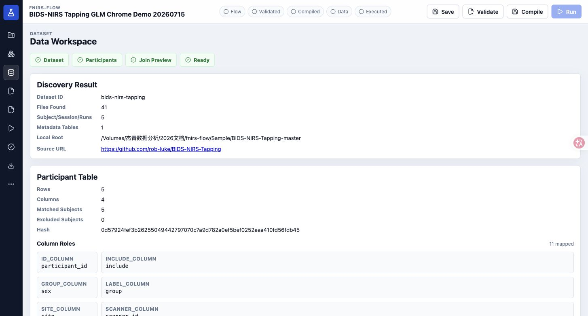

If the matched count is unexpected, fix the dataset root, participant labels, or participant table before moving to execution.

## 5. Dry Run

Open the Runs page and start with **Dry Run**. Dry run enumerates the subject/session/run units and checks the execution plan without running the full analysis.

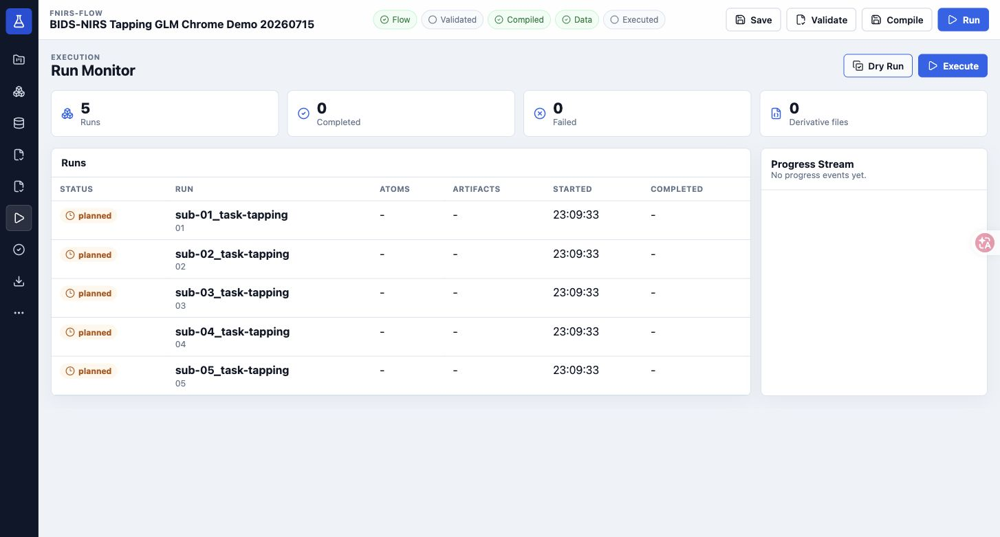

Use this step to confirm the batch size and intended run list. It is the best place to catch scope mistakes before launching a longer computation.

## 6. Fix Validation Issues if Needed

If validation reports fatal or invalid states, return to the Flow and parameter panels, fix the issue, and validate again. Continue only after the dashboard reports a valid Flow.

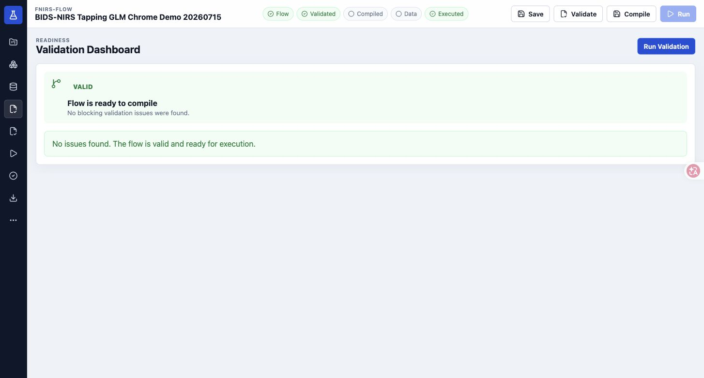

## 7. Execute the Analysis

Once the Flow is valid and the data binding is ready, execute the run. The Run Monitor records status and timing at the run level.

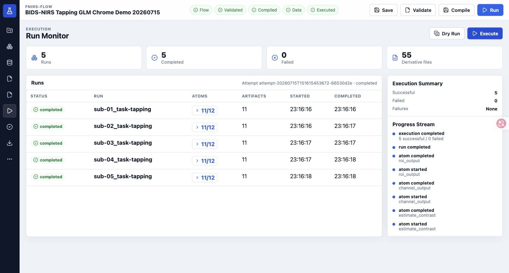

Completed, failed, and running states remain visible for review and troubleshooting.

## 8. Review Results

Open the Results Workspace and start with artifacts. Artifacts are the concrete outputs produced by the execution chain.

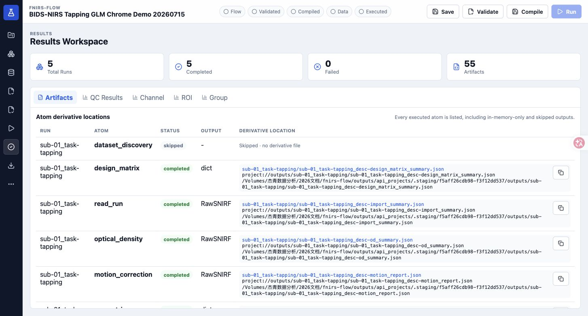

Review QC outputs next. QC tables help determine whether channels and runs are suitable for interpretation.

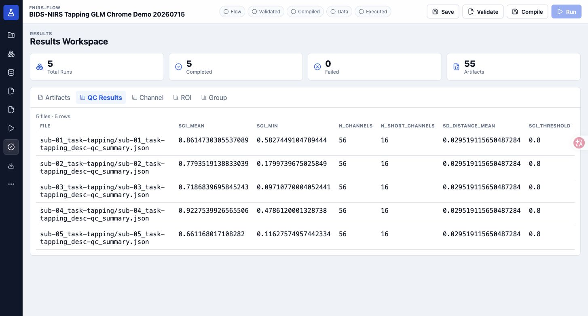

Then review channel-level statistics.

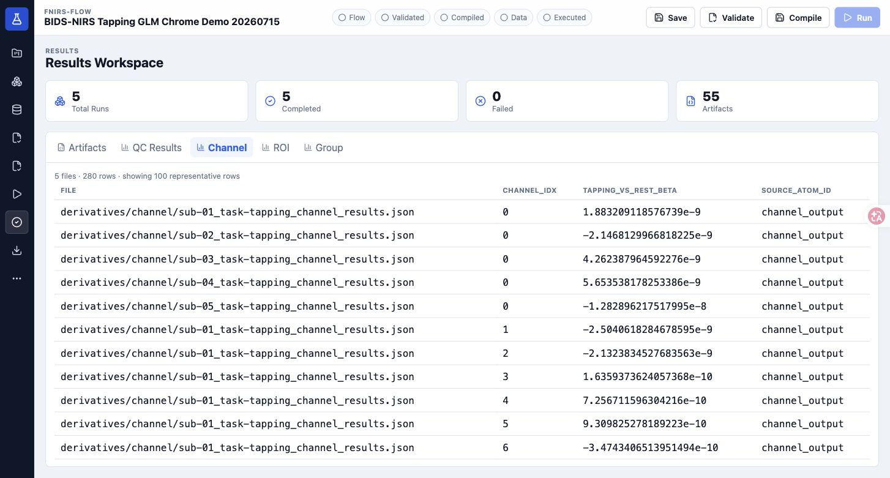

Review ROI-level results for region-level summaries.

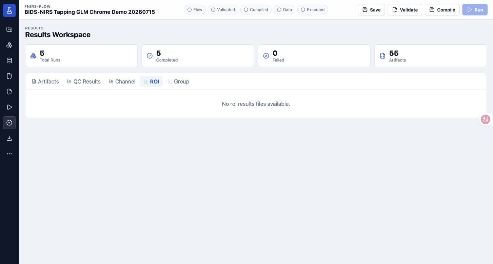

Finally, inspect group-level results.

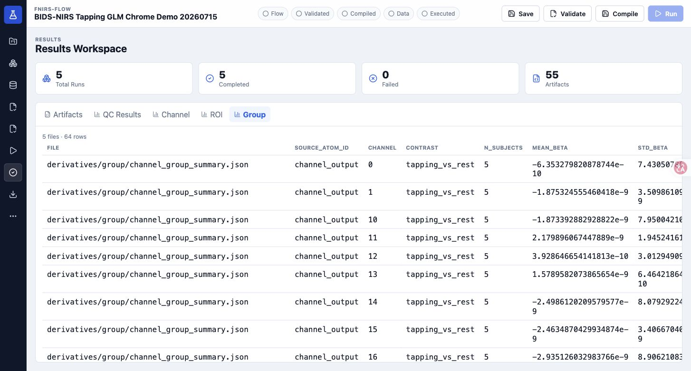

## 9. Export a Package

Open the Export page and choose the package profile that matches the handoff goal.

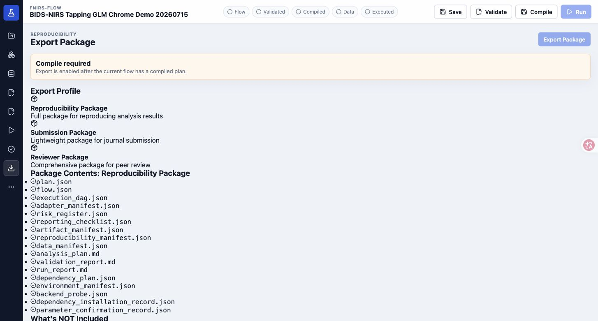

Typical profile choices:

| Profile | Use case |
|---|---|
| `submission_package` | Journal submission and supplementary material |
| `reviewer_package` | Peer-review inspection with additional provenance and failure manifests |
| `reproducibility_package` | Cross-machine rerun after relinking data |

Exported packages do not include raw data by default. They include the analysis plan, compiled outputs, manifests, validation reports, and relink instructions according to the selected profile.

## 10. Check System Diagnostics

If a run fails or a backend appears unavailable, open System Diagnostics. This page summarizes API connectivity, backend availability, environment state, and a health response.

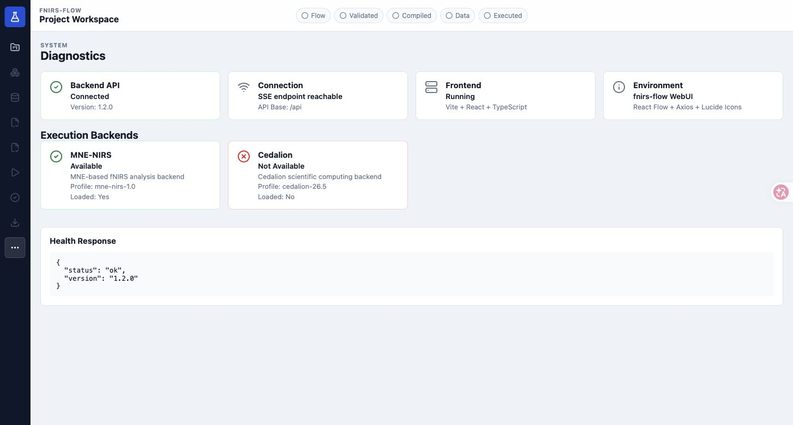

System Diagnostics is also useful when preparing a demo because it confirms that the backend and WebUI are communicating before the tutorial begins.

## Troubleshooting Notes

| Symptom | Suggested check |
|---|---|
| Dataset discovery finds no files | Confirm the dataset root and BIDS/SNIRF structure. |
| Participant Join Preview shows unmatched rows | Check participant labels and `participants.tsv` values. |
| Execute is disabled | Re-run validation and compilation; fatal validation risks block execution. |
| Export is disabled or returns no compiled plan | Compile the Flow first and confirm the plan exists. |
| Backend execution fails | Open System Diagnostics and check MNE-NIRS or Cedalion availability. |

## Teaching Script

For a short demo, use this pacing:

1. 10 seconds: create project and show the Flow canvas.
2. 30 seconds: validate, compile, discover data, and inspect participant matching.
3. 30 seconds: dry run, execute, and show the Run Monitor.
4. 30 seconds: switch through artifacts, QC, channel, ROI, and group results.
5. 10 seconds: show package export and System Diagnostics.

The main point to emphasize is that fnirs-flow turns fNIRS analysis into a validated, executable, inspectable, and portable MethodAtom Flow.
